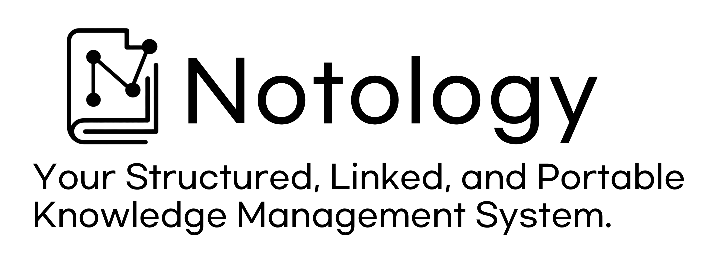

<div align="center">
  

  <p>
    <a href="#download--install">Download</a> &middot;
    <a href="#quick-start">Quick Start</a> &middot;
    <a href="README.ko.md">한국어</a> &middot;
    <a href="#who-is-notology-for">Use Cases</a> &middot;
    <a href="#notology-vs-obsidian">vs Obsidian</a> &middot;
    <a href="#features-in-depth">Features</a> &middot;
    <a href="#faq">FAQ</a>
  </p>

  <p>
    
    
    
    
    
  </p>
</div>

---

<!-- HERO IMAGE: docs/images/hero-overview.png -->
<!-- Full app screenshot showing: dark theme, sidebar with folder tree on the left, -->
<!-- rich text editor in the center with a NOTE template open (headings, callouts, task lists visible), -->
<!-- two hover windows floating on the right (one editor, one PDF), and the search panel partially visible. -->
<!-- Resolution: 1920x1080, PNG format. -->
<!--  -->

## What is Notology?

Notology is a **desktop knowledge management application** that combines structured note templates, wiki-link connections, a faceted tag system, and a powerful full-text search engine in a single native application. It is designed to help you build, organize, and navigate a personal knowledge base with the rigor of a research tool and the ease of a modern editor.

**Key principles:**

- **Plain Markdown files** &mdash; no proprietary format, no lock-in. Every note is a `.md` file with YAML frontmatter you can open in any text editor
- **Portable vault** &mdash; your vault is just a folder. Put it on a USB drive, NAS, or cloud-synced directory and use it anywhere
- **Typed notes** &mdash; 12 templates (meeting, paper, contact, canvas, and more) with structured frontmatter, not just blank pages
- **Faceted tags** &mdash; 7 tag namespaces (domain, who, org, ctx, source, method, status) for precise, multi-dimensional classification
- **Native performance** &mdash; Rust backend (Tauri v2) + React frontend. No Electron, no Chromium overhead
- **Offline-first** &mdash; no account, no subscription, no internet required
- **Bilingual** &mdash; full English and Korean support for all UI elements, template bodies, and system messages

---

## Download & Install

Go to the [Releases](https://github.com/ehxhf789789/Notology/releases/latest) page:

| File | Description |
|------|-------------|
| `Notology_x.x.x_x64-setup.exe` | Windows installer (recommended) |
| `Notology_x.x.x_x64_en-US.msi` | MSI installer |

**System requirements:** Windows 10 (version 1803 or later) or Windows 11, 64-bit, 4 GB RAM minimum.

---

## Quick Start

```
1. Download & install from Releases
2. Launch Notology
3. Click "Open Vault" -> select any folder (or create a new empty folder)
4. Press Ctrl+N -> choose a template -> enter a title -> start writing
5. Type [[ to link notes together with wiki-links
6. Press Ctrl+Shift+F -> click the Graph tab to see your knowledge network
```

> **Tip:** Place your vault folder on a NAS or external drive to use it across multiple computers. Notology includes vault locking and conflict detection to keep your data safe on shared storage.

---

## Core Concepts

Before diving into features, understanding these core concepts will help you get the most out of Notology.

### Vault

A **vault** is any folder on your file system that Notology opens as a workspace. Everything inside that folder &mdash; Markdown files, attachments, sub-folders &mdash; is part of your vault. There is no database; the folder IS your data. You can have multiple vaults (e.g., one for work, one for personal research) and switch between them.

Notology stores its own configuration inside a hidden `.notology/` folder at the vault root. This includes the search index, backup snapshots, and settings. You can safely sync this folder or exclude it from version control as you prefer.

### Folder Notes (Containers)

A **folder note** is a Markdown file whose name matches its parent folder (e.g., `Projects/Projects.md`). Notology treats this file as the "cover page" or dashboard for that folder. When you click on a folder in the sidebar, Notology opens its folder note automatically, giving you a place to write an overview, pin important links, or maintain a table of contents for the folder's contents.

Folder notes have the type `CONTAINER` in their frontmatter and use level-based CSS classes (`folder-l0`, `folder-l1`, `folder-l2`) for visual hierarchy.

### Frontmatter & YAML

Every note begins with a **YAML frontmatter** block delimited by `---`. This structured header contains metadata fields like `id`, `title`, `type`, `state`, and `tags`. Notology reads and writes this frontmatter automatically &mdash; you rarely need to edit it by hand, but you can.

The frontmatter is what makes Notology's search, graph, and filtering features possible. Each note type has its own set of fields (see the [Frontmatter Reference](#frontmatter-reference) section below).

### Wiki-Links

Type `[[` followed by a note name to create a **wiki-link**. Notology shows an auto-complete dropdown with all notes in your vault. Wiki-links are bidirectional: if Note A links to Note B, Note B's backlinks will list Note A. Use `![[image.png]]` to embed images inline.

When you rename a note, all wiki-links pointing to it update automatically across the entire vault.

### Hover Windows

**Hover windows** are floating, draggable, resizable panels that let you open multiple notes, PDFs, images, code files, or web pages simultaneously &mdash; all within the Notology window. They behave like a lightweight window manager, supporting snap zones, minimize/restore, zoom, and size presets.

### Note State (Workflow / Confidence / Maturity)

Every note carries a **state** object in its frontmatter that tracks three dimensions:

| Dimension | Values | Purpose |
|-----------|--------|---------|
| **Workflow** | `draft`, `in-progress`, `review`, `final`, `archived` | Where is this note in your writing process? |
| **Confidence** | `unverified`, `verified`, `outdated`, `disputed` | How trustworthy is the information? |
| **Maturity** | `1` to `5` (integer scale) | How developed and complete is this note? |

These states let you filter and prioritize notes. For example, you can search for all `draft` notes to find unfinished work, or filter for `outdated` notes that need updating.

### Faceted Tags

Rather than a flat list of tags, Notology uses **7 tag namespaces** (also called facets) to classify notes along multiple dimensions simultaneously. See the [Tag System](#tag-system) section for details.

---

## Tag System

Notology organizes tags into **7 namespaces** (facets). Each namespace represents a different dimension of classification, allowing precise multi-dimensional filtering.

| Namespace | Prefix | Purpose | Example Values |
|-----------|--------|---------|----------------|
| **domain** | `domain/` | Subject area or discipline | `domain/physics`, `domain/marketing`, `domain/history` |
| **who** | `who/` | People involved or referenced | `who/alice`, `who/prof-kim`, `who/team-lead` |
| **org** | `org/` | Organization, company, or institution | `org/acme-corp`, `org/mit`, `org/client-x` |
| **ctx** | `ctx/` | Context or situation | `ctx/weekly-standup`, `ctx/thesis`, `ctx/q4-planning` |
| **source** | `source/` | Where the information came from | `source/interview`, `source/arxiv`, `source/field-notes` |
| **method** | `method/` | Methodology or approach used | `method/survey`, `method/experiment`, `method/case-study` |
| **status** | `status/` | Project or task status | `status/active`, `status/blocked`, `status/completed` |

**Why faceted tags?** Flat tags create ambiguity. Is `#alice` a person, an organization, or a project name? Faceted tags eliminate this confusion. When you tag a meeting note with `who/alice`, `org/acme-corp`, and `ctx/q4-planning`, you can later filter by any combination of these dimensions independently.

Tags are defined per-template in the Settings panel. You can pre-configure tag categories for each template type so that new notes of that type start with commonly used tags.

---

## Folder Notes & Containers

The **folder note** pattern turns folders into first-class organizational units:

```
Research/
  Research.md          <-- folder note (type: CONTAINER)
  PAPER_Attention.md
  PAPER_Transformers.md
  Data/
    Data.md            <-- nested folder note
    DATA_Survey.md
```

**Key behaviors:**

- **Auto-creation**: When you create a new folder via Notology, a folder note with matching name is created automatically
- **Dashboard view**: Clicking a folder in the sidebar opens its folder note, which includes an embedded search scoped to that folder's contents
- **Level hierarchy**: Root-level folders get CSS class `folder-l0`, first-level sub-folders get `folder-l1`, deeper folders get `folder-l2`, providing visual styling cues
- **Graph integration**: Folder notes appear with a distinct visual style in the Graph View, helping you see the organizational structure
- **Not linkable**: Folder notes are intentionally filtered out of `[[wiki-link]]` suggestions to keep links focused on content notes

---

## Who is Notology For?

<div align="center">
  
</div>

Notology adapts to any knowledge-intensive workflow. Here are real-world examples:

### Writers & Storytellers

<!-- IMAGE: docs/images/usecase-writer.png -->
<!-- Screenshot showing: a folder tree with folders like "Characters/", "Locations/", "Plot Arcs/", -->
<!-- a CONTACT template used as a character sheet (name, traits, relationships in frontmatter), -->
<!-- and the Graph View showing character-to-location connections via wiki-links. -->
<!--  -->

Manage your novel's universe intuitively. Use **CONTACT templates** as character sheets with structured fields for traits, backstory, and relationships. Create **folder notes** for locations, plot arcs, and timelines. The **Graph View** reveals hidden connections between characters, events, and settings &mdash; giving you a bird's-eye view of your entire story world.

> *Example vault structure:*
> ```
> My Novel/
> ├── Characters/
> │   ├── Characters.md          (folder note: character index)
> │   ├── CONTACT_Aria.md        (character sheet)
> │   └── CONTACT_Marcus.md
> ├── Locations/
> │   ├── Locations.md
> │   └── NOTE_The Old Library.md
> ├── Plot Arcs/
> │   ├── NOTE_Act 1 - The Call.md
> │   └── NOTE_Act 2 - The Journey.md
> └── Research/
>     ├── LIT_Medieval Architecture.md
>     └── DATA_Historical Timeline.md
> ```

### Researchers & Academics

<!-- IMAGE: docs/images/usecase-researcher.png -->
<!-- Screenshot showing: PAPER template with DOI/authors fields filled, LIT template with key arguments, -->
<!-- multiple hover windows open side-by-side (one PDF paper, one note with annotations), -->
<!-- and search results filtering by type:PAPER. -->
<!--  -->

Build your personal research library. Use **PAPER templates** to capture DOI, authors, and abstracts for every paper you read. Link papers together with `[[wiki-links]]` to trace idea lineage. Open **hover windows** to read PDFs and take notes simultaneously. Use **THEORY templates** to explore hypotheses and **DATA templates** to document datasets and methodology.

- **Literature review**: LIT template captures source, key arguments, and your critical notes
- **Cross-referencing**: Wiki-links between papers, theories, and data create an interconnected knowledge base
- **Instant recall**: Tantivy full-text search finds any paper, quote, or concept across thousands of notes in milliseconds
- **Semantic relations**: Use the `relations` field in frontmatter to formally link notes with typed relationships (`supports`, `refutes`, `extends`, `derives-from`, etc.)

### Office Professionals

<!-- IMAGE: docs/images/usecase-office.png -->
<!-- Screenshot showing: MTG template with attendees and agenda filled in, calendar view with task dots, -->
<!-- sidebar showing folders organized by project ("Project Alpha/", "Admin/", "Weekly Reports/"), -->
<!-- and the detail search mode filtering by date range. -->
<!--  -->

Streamline daily workflow and personal knowledge management. **MTG templates** auto-generate meeting minutes with attendees, agenda, and action items. Track deadlines in the **Calendar View**. Organize projects with containers and find anything instantly with **5 search modes**. The **memo system** lets you annotate documents without modifying originals.

- **Meeting minutes**: MTG template with date-prefixed filenames keeps everything chronological
- **Project organization**: One folder per project, folder notes as project dashboards
- **Portable office**: Store your vault on a NAS and access it from office, home, or on the go

### Students (High School & University)

<!-- IMAGE: docs/images/usecase-student.png -->
<!-- Screenshot showing: SEM template with speaker/topic fields, editor with callout blocks -->
<!-- (info, tip, warning types) for study notes, wiki-links connecting concepts across subjects, -->
<!-- and Graph View showing a knowledge network colored by domain tags. -->
<!--  -->

Systematize your learning across all subjects. Use **SEM templates** for lecture notes with speaker and topic fields. Create concept maps with **wiki-links** that connect ideas across subjects &mdash; link a physics concept to a math derivation to a lab report. The **Graph View** reveals how your knowledge connects, reinforcing memory through visual association.

- **Study notes**: Markdown formatting with callout blocks, code blocks, and math notation
- **Exam prep**: Full-text search across all notes &mdash; find every mention of a concept instantly
- **Knowledge mapping**: Graph View shows which topics are well-connected and which need more study
- **Portable**: Carry your entire study vault on a USB drive between home, school, and library

---

## Notology vs Obsidian

Notology is inspired by Obsidian's vault-based approach and wiki-link philosophy. Here is what differentiates the two:

| | **Notology** | **Obsidian** |
|--|-------------|-------------|
| **Engine** | Tauri v2 (Rust + WebView) | Electron (Chromium) |
| **Search** | Tantivy full-text engine (Rust) with CJK support | Built-in file search |
| **Note types** | 12 structured templates with auto-frontmatter & state tracking | Blank markdown + community templates |
| **Tag system** | 7 faceted namespaces (domain, who, org, ctx, source, method, status) | Flat tags |
| **Multi-window** | Built-in hover windows (drag, snap, resize, minimize, zoom) | Pop-out windows (separate OS windows) |
| **Canvas** | Flowchart shapes (diamond, parallelogram, circle, rectangle) + connection arrows | Cards and connections |
| **Comments** | Built-in per-note comment/memo system with task checkboxes | Plugin required |
| **Graph** | Force-directed with adjustable physics controls + type/tag coloring | Built-in graph |
| **Note state** | Built-in workflow / confidence / maturity tracking | Manual or plugin |
| **Relations** | Typed semantic relations (supports, refutes, extends, etc.) | Manual wiki-links only |
| **Portable vault** | Vault locking + Synology conflict detection + atomic writes | Sync via paid service |
| **i18n** | English + Korean (full UI + template bodies) | Community translations |
| **Price** | Free and open source | Free core, paid Sync/Publish |
| **Code** | Open source (MIT) | Closed source |

---

## Features in Depth

### 1. Rich Text Editor

A TipTap-based editor that renders Markdown as rich text in real time, powered by ProseMirror under the hood.

<!-- GIF: docs/gifs/01-editor.gif -->
<!-- Recording (8-10 seconds): Start with an empty NOTE template. Type "# Meeting Summary" (renders as H1), -->
<!-- then "- Action item 1" (renders as bullet), then "> Important quote" (renders as blockquote). -->
<!-- Toggle the editor toolbar between expanded and collapsed mode. Show a callout block being inserted -->
<!-- (select "info" type) with colored border appearing. End by typing a task list "- [ ] Review docs". -->
<!-- Window size: 1200x700, dark theme. Smooth cursor movement, no rushed actions. -->
<!--  -->

- **Markdown + WYSIWYG hybrid** &mdash; type `# `, `- `, `> ` and watch it render instantly. No split-pane preview needed
- **6 callout blocks** &mdash; info, warning, error, success, note, tip. Each has a distinct colored border and icon
- **Tables** with colored cells, header rows, and full row/column operations (add, delete, merge) via right-click context menu
- **Code blocks** with syntax highlighting powered by highlight.js (180+ languages, VS2015 dark theme)
- **Task lists** with interactive checkboxes &mdash; checked items are tracked by the Calendar view
- **Subscript / Superscript** for scientific notation (H<sub>2</sub>O, x<sup>2</sup>)
- **Collapsible toolbar** &mdash; full formatting bar with all options, or minimal mode for distraction-free writing. Default state is configurable
- **Right-click context menu** &mdash; formatting options, table operations, and wiki-link management accessible via right-click
- **Custom keyboard shortcuts** &mdash; every formatting action is remappable in Settings
- **Drag-and-drop** &mdash; drop files directly into the editor to create attachments or embed images
- **11 TipTap extensions** &mdash; StarterKit, Markdown, Highlight, Subscript, Superscript, TaskList, TaskItem, Underline, WikiLink, Callout, Indent, CommentMarks, CustomShortcuts

### 2. Wiki-Links & Backlinks

The backbone of your knowledge graph. Link any note to any other note with `[[double brackets]]`.

<!-- GIF: docs/gifs/02-wikilinks.gif -->
<!-- Recording (8-10 seconds): In an open note, type "Related to [[" and show the auto-complete dropdown -->
<!-- appearing with note suggestions (show 4-5 note titles in the list). Select a note, link renders. -->
<!-- Then type " -->

- **Auto-complete** &mdash; type `[[` and get real-time suggestions from all notes in your vault. Folder notes are filtered out to keep suggestions focused on content notes
- **Image embedding** &mdash; `![[photo.png]]` renders the image inline in the editor
- **Auto-update on rename** &mdash; rename a note and all `[[links]]` pointing to it update automatically across every file in the vault
- **Backlink tracking** &mdash; see every note that links to the current note in the search detail view
- **Cross-container linking** &mdash; link between different folders freely; the graph will show connections across your entire vault
- **Immutable link nodes** &mdash; wiki-links render as atomic nodes in the editor, preventing accidental text modification. Links are converted automatically from text `[[...]]` patterns
- **Right-click management** &mdash; right-click a wiki-link to open the linked note or delete the link
- **Attachment awareness** &mdash; `.md` files in `_att` folders are treated as attachments, not vault notes, preventing confusion in link suggestions

### 3. 12 Structured Note Templates

Unlike blank-page note apps, Notology provides **typed notes** with structured frontmatter. Each template generates a complete YAML frontmatter block and a pre-formatted body with section headings.

<!-- GIF: docs/gifs/03-templates.gif -->
<!-- Recording (10-12 seconds): Press Ctrl+N to open the template selector modal. -->
<!-- Show the 12 template icons in a grid. Click "MTG" (Meeting) - show the auto-generated filename -->
<!-- with date prefix appearing. The new note opens with pre-filled YAML frontmatter -->
<!-- (title, attendees, agenda fields). Then press Ctrl+N again, select "PAPER" - show the -->
<!-- DOI, authors, abstract fields in frontmatter. Brief pause to show the structured body template. -->
<!-- Window size: 1200x700, dark theme. -->
<!--  -->

| Template | Prefix | Use Case | Type-Specific Fields | Body Sections |
|----------|--------|----------|---------------------|---------------|
| **Note** | `NOTE` | Everyday notes, general writing | &mdash; | Overview, Content |
| **Sketch** | `SKETCH` | Visual diagrams, flowcharts | `canvas: true` | (canvas editor, no markdown body) |
| **Meeting** | `MTG` | Meeting minutes, standups | `date`, `participants[]` | Meeting Info, Agenda, Discussion, Decisions |
| **Seminar** | `SEM` | Seminar & lecture notes | &mdash; | Overview, Content, Key Points |
| **Event** | `EVENT` | Event documentation | `date`, `location`, `organizer`, `participants[]` | Event Info, Overview, Schedule |
| **Official Affairs** | `OFA` | Official/administrative records | &mdash; | Overview, Content, Decisions |
| **Paper** | `PAPER` | Research paper notes | `authors[]`, `year`, `venue`, `doi`, `url` | Paper Info, Summary, Contributions, Methodology, Results |
| **Literature** | `LIT` | Literature review | `authors[]`, `year`, `publisher`, `source`, `url` | Literature Info, Summary, Key Content |
| **Data** | `DATA` | Data documentation | &mdash; | Overview, Data Description |
| **Theory** | `THEO` | Theory exploration | &mdash; | Definition, Background, Key Concepts, Applications, Related Theories |
| **Contact** | `CONTACT` | Contact cards, character sheets | `email`, `phone`, `organization`, `role`, `aliases[]` | Contact Info, History, Related Notes |
| **Setup** | `SETUP` | Configuration notes, environment setup | &mdash; | Overview, Context |

**Each template provides:**

- **Auto-generated filename** with date prefix (e.g., `MTG_260208_Weekly_Standup.md`)
- **Structured YAML frontmatter** with all base fields (`id`, `title`, `type`, `created`, `modified`, `state`, `tags`, `relations`, `cssclasses`) plus type-specific fields
- **7 faceted tag categories** pre-initialized as empty arrays, ready for tagging
- **Custom color coding** configurable per template &mdash; applied to hover window borders, search results, template selector, and minimized buttons
- **Custom icons** selectable from 12 predefined icon types
- **Pre-configured tag categories** &mdash; define default domain/who/org/ctx tags per template in Settings for auto-population
- **Language-aware body** &mdash; section headings and field labels render in English or Korean based on your language setting
- **State defaults** &mdash; each template type starts with sensible defaults (e.g., CONTACT starts as `workflow: final`, `confidence: verified`, `maturity: 3`)

### 4. Hover Windows (Multi-Window Editing)

Open multiple notes simultaneously in floating, draggable windows &mdash; without leaving the app.

<!-- GIF: docs/gifs/04-hover-windows.gif -->
<!-- Recording (10-12 seconds): Open a note from the sidebar (it opens in a hover window). -->
<!-- Drag the window to reposition it. Open a second note (another hover window appears). -->
<!-- Resize the first window by dragging its corner. Drag the second window to the right -->
<!-- edge of the screen to trigger the snap zone (window auto-arranges to half-screen). -->
<!-- Open a PDF file (third hover window with embedded PDF viewer). Minimize one window -->
<!-- (show the minimize animation). Click the minimized tab to restore it. -->
<!-- Window size: 1400x900, dark theme. Show at least 3 hover windows simultaneously. -->
<!--  -->

- **Drag & drop** positioning anywhere on screen
- **Resize** from any edge or corner
- **Snap zones** &mdash; drag to screen edges to auto-arrange windows in halves or quadrants
- **Minimize / restore** with animation. Minimized windows appear as tabs in the right-side collapsed panel
- **4 size presets** &mdash; Small, Medium, Large, XL (accessible via keyboard shortcut)
- **Zoom** &mdash; Ctrl+Scroll to zoom in/out per window independently
- **Content caching** &mdash; switch between windows instantly; content is preserved in memory
- **Z-index management** &mdash; clicking a window brings it to front, Windows-taskbar-style focus behavior
- **Template color theming** &mdash; hover window borders and headers reflect the note type's custom color
- **Folder note integration** &mdash; folder notes opened in hover windows include an embedded search panel scoped to that folder

**5 content types supported:**

| Type | Opens When | Capabilities |
|------|-----------|--------------|
| **Editor** | `.md` files | Full editing with toolbar, frontmatter panel, comment panel |
| **PDF** | `.pdf` files | Embedded PDF viewer |
| **Image** | `.png`, `.jpg`, `.gif`, `.webp`, etc. | Zoomable preview |
| **Code** | `.js`, `.py`, `.rs`, `.json`, `.html`, etc. | Syntax-highlighted read-only view (highlight.js, VS2015 theme) |
| **Web** | URLs | Embedded web preview |

### 5. Interactive Graph View

Visualize your entire knowledge network as a force-directed graph.

<!-- GIF: docs/gifs/05-graph.gif -->
<!-- Recording (10-12 seconds): Switch to the Graph tab in the search panel. Show the full graph -->
<!-- with 30-50 nodes rendered (notes in various template colors, tag nodes in gray, -->
<!-- folder notes with distinct borders). Drag a node and release it (physics simulation responds). -->
<!-- Adjust the "repulsion" slider to spread nodes apart. Adjust "link distance" slider. -->
<!-- Type a search query in the filter box - non-matching nodes fade out, matches glow yellow. -->
<!-- Click a node to open it as a hover window. Show both dark and light theme if possible. -->
<!-- Window size: 1400x900. -->
<!--  -->

- **Force-directed layout** powered by d3-force, producing organic, physics-based node arrangement
- **Adjustable physics** &mdash; four sliders for fine-tuning the layout:
  - **Repulsion**: how strongly nodes push each other apart
  - **Link distance**: ideal distance between connected nodes
  - **Gravity**: how strongly nodes are pulled toward the center
  - **Center force**: how tightly the graph clusters around the viewport center
- **Node types** &mdash; notes are colored by template type using custom colors; tags appear by namespace; attachments have their own style
- **Folder notes** highlighted with a distinct visual style so you can see organizational structure at a glance
- **Filter** by note type, tag, or free-text search query &mdash; non-matching nodes fade out, matches glow
- **Click to open** any note directly from the graph as a hover window
- **Real-time updates** &mdash; graph refreshes as you create, edit, or delete notes
- **Dark & Light mode** &mdash; fully adaptive to your theme preference
- **Persistent settings** &mdash; physics configuration is saved per-vault

### 6. Canvas Editor

A spatial thinking tool for creating flowcharts, mind maps, and diagrams. Activated when you create a SKETCH template note.

<!-- GIF: docs/gifs/06-canvas.gif -->
<!-- Recording (10-12 seconds): Open a SKETCH template. The infinite canvas appears. -->
<!-- Add a rectangle node (type "Start Process" inside it). Add a diamond node (type "Decision?"). -->
<!-- Draw a connection arrow from rectangle to diamond. Add a circle node (type "End"). -->
<!-- Draw arrows from diamond to circle. Pan the canvas by dragging, then zoom in/out with scroll. -->
<!-- Show the parallelogram shape being added. End with the complete flowchart visible. -->
<!-- Window size: 1200x700, dark theme. -->
<!--  -->

- **Infinite canvas** with smooth pan and zoom (scroll wheel to zoom, drag empty space to pan)
- **4 shape types** for standard flowchart notation:
  - **Rectangle** &mdash; processes and actions
  - **Diamond** &mdash; decisions and branches
  - **Circle** &mdash; start and end points
  - **Parallelogram** &mdash; input/output operations
- **Connection arrows** between shapes &mdash; click a connection handle and drag to another shape. 30px tolerance for easy targeting
- **Rich text inside nodes** &mdash; nodes support TipTap editing, not just plain text
- **Multi-selection** &mdash; click and drag to select multiple nodes; click empty space to deselect
- **Cursor modes** &mdash; visual cursor feedback for panning (grabbing), selecting (crosshair), and connecting (crosshair)
- **Canvas data stored in frontmatter** &mdash; the `canvas: true` flag in frontmatter enables canvas mode; shape/connection data is serialized alongside the note

### 7. Full-Text Search (5 Modes)

Powered by **Tantivy** (the Rust equivalent of Apache Lucene), search is instant even with thousands of notes. Tantivy includes a CJK tokenizer for excellent Korean and Japanese text search.

<!-- GIF: docs/gifs/07-search.gif -->
<!-- Recording (12-15 seconds): Open the search panel (Ctrl+Shift+F). Type a query in Notes mode -->
<!-- - show instant results appearing. Switch to "Body" tab - show full-text results with -->
<!-- highlighted matching snippets. Switch to "Attachments" tab - show PDF/image files listed. -->
<!-- Switch to "Details" tab - show the metadata filter UI (date range picker, type filter, -->
<!-- tag filter dropdowns). Select a date range and type filter, results update live. -->
<!-- Finally switch to "Graph" tab - show the visual graph with search highlighting. -->
<!-- Window size: 1400x900, dark theme. -->
<!--  -->

| Mode | What It Does | Example |
|------|-------------|---------|
| **Notes** | Search by title, tags, and note type. Results show frontmatter metadata | `type:MTG tag:project-alpha` |
| **Body** | Full-text content search with highlighted matching snippets | `"quarterly review"` |
| **Attachments** | Find files by name, extension, or size. Shows which note each attachment belongs to | `*.pdf` |
| **Details** | Metadata browser with multi-filter UI: date range picker, type filter, tag filter, memo count | Filter by date range + type + tag |
| **Graph** | Visual graph with search highlighting &mdash; matching nodes glow, non-matches fade | Click nodes to navigate |

**Search features:**

- **Instant indexing** &mdash; when you create, edit, or delete a note, the search index updates immediately (no need to wait for a background re-index)
- **File watcher** &mdash; a background watcher (notify crate, 500ms debounce) monitors the vault for external changes and re-indexes automatically
- **Scoped search** &mdash; when viewing a folder note, the embedded search panel is scoped to that folder's contents
- **Backlink search** &mdash; find all notes that link to a specific note
- **Full re-index** &mdash; trigger a complete vault re-index from the command palette if needed

### 8. Calendar View

Track tasks, memos, and events on a monthly calendar.

<!-- GIF: docs/gifs/08-calendar.gif -->
<!-- Recording (8-10 seconds): Open the calendar (Ctrl+Shift+C). Show the monthly grid with -->
<!-- task count dots on several dates. Click a date that has tasks - show the detail panel -->
<!-- expanding with note titles, task checkboxes, and memos for that day. -->
<!-- Navigate to the next month with the arrow button. Click another date. -->
<!-- Click "Create note" button on a date to show the template selector. -->
<!-- Window size: 1200x700, dark theme. -->
<!--  -->

- **Monthly grid** with task count indicator dots on each date
- **Date detail panel** &mdash; click a date to see all notes, tasks (with checkboxes), and memos for that day
- **Create notes from calendar** &mdash; click the create button on any date to open the template selector with that date pre-filled
- **Month navigation** with arrow buttons
- **Keyboard shortcut** &mdash; `Ctrl+Shift+C` to toggle the calendar view

### 9. Comment & Memo System

Add persistent annotations to any note without modifying the note body. Comments are stored in sidecar JSON files (alongside the note), keeping the Markdown content clean.

<!-- IMAGE: docs/images/10-comments.png -->
<!-- Screenshot showing: an open note with highlighted text and a comment bubble, -->
<!-- the comment panel on the right side with 3-4 comments (including one with a task checkbox), -->
<!-- and the memo count badge visible in the search results list on the left. -->
<!-- Window size: 1400x900, dark theme. -->
<!--  -->

- **Inline comments** &mdash; highlight any text in the editor and attach a comment. The highlighted region is marked with a visual decoration
- **Standalone memos** &mdash; add free-form memos to a note without selecting specific text
- **Task tracking** &mdash; comments can contain task checkboxes, which are tracked in the Calendar view
- **Memo count badges** shown in search results for quick overview of annotation density
- **Toggle panel** &mdash; `Ctrl+M` to show/hide the comment panel; `Ctrl+Shift+M` for the metadata panel
- **Sidecar storage** &mdash; comments are stored as JSON files next to the note (e.g., `Note.md.comments.json`), keeping the Markdown file pristine

### 10. Portable Vault &mdash; Take Your Notes Anywhere

Your vault is just a folder. No database, no proprietary format. This means you can:

- **NAS** &mdash; put your vault on a NAS (Synology, QNAP, etc.) and access it from any computer on your network
- **External drive** &mdash; carry your vault on a USB drive or external SSD
- **Cloud sync** &mdash; use any sync service (Dropbox, Google Drive, OneDrive) since the vault is just standard files and folders

**Built-in safety for shared storage:**

| Feature | Description |
|---------|-------------|
| **Vault locking** | A lock file is created when a vault is opened, preventing two instances of Notology (e.g., on two different computers) from editing the same vault simultaneously. The lock is released when you close the vault |
| **Synology conflict detection** | Notology actively detects `.SynologyDrive` conflict files (created when Synology Drive detects simultaneous edits) and alerts you to resolve them manually |
| **Atomic writes** | All file writes use a temp-file + rename pattern (`write to .tmp` then `rename to .md`), preventing partial writes from corrupting files if a sync operation interrupts a save |
| **Bulk sync awareness** | When a large sync operation is in progress (many files changing at once), Notology pauses UI updates to avoid flickering and unnecessary re-renders |

### 11. Backup System

Notology maintains automatic backups of your notes inside the `.notology/backups/` directory at the vault root.

- **Automatic versioning** &mdash; up to **5 backup versions** are kept per file
- **7-day retention** &mdash; backup files older than 7 days are automatically cleaned up
- **Non-intrusive** &mdash; backups run in the background without affecting editor performance
- **Portable** &mdash; backups live inside the vault folder, so they travel with your vault if you move it to a different drive or computer

### 12. Settings & Customization

<!-- IMAGE: docs/images/11-settings.png -->
<!-- Screenshot showing: the Settings panel open with sections visible: -->
<!-- Appearance (theme selector showing Dark/Light/System, font selector), -->
<!-- Language toggle (Korean/English), Keyboard shortcuts section with remappable keys, -->
<!-- and the template editor showing enabled/disabled template toggles. -->
<!-- Show both dark and light theme variants side by side if possible. -->
<!-- Window size: 1200x700. -->
<!--  -->

The Settings panel is organized into multiple tabs:

- **Appearance**
  - **Themes** &mdash; Dark, Light, or System (auto-detect based on OS preference)
  - **Fonts** &mdash; built-in font options plus custom font loading
- **Language**
  - **English** and **Korean** &mdash; full i18n support for all UI elements, system messages, template section headings, and field labels
- **Editor**
  - **Toolbar default state** &mdash; choose whether the formatting toolbar starts expanded or collapsed
- **Templates**
  - **Enable/disable templates** &mdash; hide templates you do not use from the template selector
  - **Custom colors** &mdash; pick from 12 preset color themes or enter a custom hex color. The color is applied to hover window borders, search result accents, template selector items, and minimized window buttons
  - **Custom icons** &mdash; choose from 12 predefined icon types for each template
  - **Tag categories** &mdash; pre-configure domain/who/org/ctx tags per template for auto-population when creating new notes
- **Keyboard shortcuts**
  - **Fully remappable** &mdash; every action (navigation, formatting, system commands) can be reassigned
  - **Visual keyboard layout** &mdash; an interactive keyboard display shows current bindings at a glance
- **Graph physics**
  - **Persistent per-vault** &mdash; repulsion, link distance, gravity, and center force settings are saved and restored for each vault
- **Containers**
  - **Per-container configuration** &mdash; customize settings for individual folder containers

---

## Frontmatter Reference

Every note's YAML frontmatter follows this schema. Fields marked with `*` are always present; others depend on note type.

```yaml
# === Base Fields (all note types) ===
id: "20260209143052"           # * 14-digit timestamp (YYYYMMDDHHmmss), auto-generated
title: "My Note Title"         # * Note title
type: NOTE                     # * One of: NOTE, SKETCH, MTG, SEM, EVENT, OFA, PAPER, LIT, DATA, THEO, CONTACT, SETUP
created: "2026-02-09T14:30:52.000Z"   # * ISO 8601 timestamp
modified: "2026-02-09T15:12:00.000Z"  # * Updated automatically on save

# --- State ---
state:                         # * Tracks note lifecycle
  workflow: draft              #   draft | in-progress | review | final | archived
  confidence: unverified       #   unverified | verified | outdated | disputed
  maturity: 1                  #   1-5 integer scale

# --- Faceted Tags ---
tags:                          # 7 namespaces, each an array of strings
  domain: []                   #   Subject area (e.g., physics, marketing)
  who: []                      #   People (e.g., alice, prof-kim)
  org: []                      #   Organizations (e.g., acme-corp, mit)
  ctx: []                      #   Context (e.g., weekly-standup, thesis)
  source: []                   #   Information source (e.g., interview, arxiv)
  method: []                   #   Methodology (e.g., survey, experiment)
  status: []                   #   Project status (e.g., active, blocked)

# --- Relations ---
relations:                     # Typed links to other notes
  - relation_type: supports    #   supports | refutes | extends | implements
    target: "[[Other Note]]"   #   | derives-from | part-of | is-example-of | causes
    strength: 0.8              #   Optional: 0.0 to 1.0

# --- Styling ---
cssclasses:                    # CSS classes for visual theming
  - note-type                  #   Auto-set based on template type

# === Type-Specific Fields ===

# MTG (Meeting)
date: "2026-02-09T14:00:00.000Z"
participants:
  - "Alice"
  - "Bob"

# PAPER (Research Paper)
authors:
  - "Smith, J."
  - "Doe, A."
year: 2026
venue: "Nature"
doi: "10.1234/example"
url: "https://example.com/paper"

# LIT (Literature)
authors:
  - "Author Name"
year: 2025
publisher: "Academic Press"
source: "Journal of Example Studies"
url: "https://example.com"

# EVENT
date: "2026-03-15"
location: "Conference Center, Seoul"
organizer: "Department of CS"
participants:
  - "Team A"
  - "Team B"

# CONTACT
email: "alice@example.com"
phone: "+1-555-0100"
organization: "Acme Corp"
role: "Lead Engineer"
aliases:
  - "@Alice"

# SKETCH (Canvas)
canvas: true
```

---

## Keyboard Shortcuts

| Category | Shortcut | Action |
|----------|----------|--------|
| **Navigation** | `Ctrl+N` | New note (opens template selector) |
| | `Ctrl+Shift+F` | Toggle search panel |
| | `Ctrl+Shift+C` | Toggle calendar view |
| | `Ctrl+Left` | Toggle left sidebar |
| | `Ctrl+Right` | Toggle right hover panel |
| **Formatting** | `Ctrl+B / I / U` | Bold / Italic / Underline |
| | `Ctrl+Shift+X` | Strikethrough |
| | `Ctrl+E` | Inline code |
| | `Ctrl+Shift+H` | Highlight |
| | `Ctrl+1` through `Ctrl+6` | Heading 1 through 6 |
| **Blocks** | `Ctrl+Shift+8` | Bullet list |
| | `Ctrl+Shift+7` | Ordered list |
| | `Ctrl+Shift+9` | Task list |
| | `Ctrl+Shift+B` | Blockquote |
| | `Ctrl+Shift+E` | Code block |
| **System** | `Ctrl+S` | Save |
| | `Ctrl+D` | Delete note |
| | `Ctrl+M` | Toggle memo/comment panel |
| | `Ctrl+Shift+M` | Toggle metadata panel |
| | `Ctrl+Z` | Undo |
| | `Ctrl+Shift+Z` | Redo |

All shortcuts are fully remappable in **Settings > Shortcuts** with a visual keyboard layout.

---

## Advanced Topics

### Vault Locking Mechanism

When Notology opens a vault, it creates a lock file (`.notology/vault.lock`) at the vault root. This prevents a second instance of Notology on another computer from simultaneously opening and editing the same vault, which could cause data conflicts.

- The lock file contains the machine identifier and timestamp
- If Notology detects an existing lock, it warns you and offers to force-unlock (useful if a previous session crashed without releasing the lock)
- The lock is released automatically when you close the vault or quit the application

### NAS Safety (Synology & Network Drives)

Notology is designed to work safely on network-attached storage:

- **Synology conflict detection**: Synology Drive creates files with names like `MyNote (SynologyDrive Conflict).md` when it detects a sync conflict. Notology scans for these conflict markers and alerts you, so you can manually merge changes
- **Atomic writes**: Every file save follows a temp-file + rename pattern. The note is first written to a temporary file (e.g., `Note.md.tmp`), then atomically renamed to the final path. This prevents partial/corrupted files if a network interruption occurs mid-write
- **Bulk sync awareness**: When the file watcher detects a burst of rapid changes (common during initial Synology Drive sync), Notology dampens UI refreshes to avoid performance degradation and visual flickering

### Backup System Details

The backup system lives inside `.notology/backups/` within your vault:

```
.notology/
  backups/
    MyNote.md/
      2026-02-09T143052.md
      2026-02-08T091500.md
      2026-02-07T160030.md    (up to 5 versions)
```

- **Trigger**: A backup snapshot is created each time a note is saved
- **Retention**: Maximum 5 versions per file; versions older than 7 days are pruned automatically
- **Recovery**: To restore a previous version, navigate to the backups folder and copy the desired version back to your vault manually

### Attachment System

Each note can have an associated attachments folder:

```
MyNote.md
MyNote.md_att/          (or MyNote_att/)
  diagram.png
  reference.pdf
  data.csv
```

- Files dropped into the editor are automatically saved to the note's `_att` folder
- Attachments are referenced via wiki-links and can be opened in hover windows
- `.md` files inside `_att` folders are treated strictly as attachments, not as vault notes &mdash; they will not appear in search results, wiki-link suggestions, or the graph view
- Deleting an attachment also removes its wiki-link from the parent note automatically

### Internationalization (i18n)

Notology supports **English** and **Korean** as first-class languages:

- All UI elements (menus, buttons, labels, tooltips, dialogs) are fully translated
- Template body section headings render in the selected language (e.g., "Overview" vs. "개요")
- Template field labels are language-aware (e.g., "Authors" vs. "저자")
- Folder note guide text adapts to language setting
- Language is switchable at any time in Settings without restarting

---

## FAQ

**Q: Where is my data stored?**
A: Your vault is just a folder you chose when opening Notology. All notes are plain `.md` files with YAML frontmatter. Notology stores its configuration, search index, and backups in a `.notology/` subfolder inside your vault. There is no external database.

**Q: Can I open my vault in another Markdown editor?**
A: Yes. Every note is a standard Markdown file. The YAML frontmatter follows common conventions. You can open, edit, and view your notes in VS Code, Typora, iA Writer, or any text editor. You will lose Notology-specific features (hover windows, graph, search modes) but your content remains fully accessible.

**Q: Does Notology sync my notes?**
A: Notology does not include its own sync service. Instead, it is designed to work with any file sync tool: Synology Drive, Dropbox, Google Drive, OneDrive, Resilio Sync, etc. Because your vault is just a folder of files, any sync service that handles files will work. Notology includes vault locking and conflict detection to keep things safe.

**Q: Can I use Notology on macOS or Linux?**
A: Currently, Notology is Windows-only. macOS and Linux builds are on the roadmap.

**Q: Is Notology free?**
A: Yes. Notology is free and open source under the MIT license. There are no paid tiers, no subscriptions, and no feature gates.

**Q: How does search work under the hood?**
A: Search is powered by Tantivy, a Rust full-text search library equivalent to Apache Lucene. Notology builds and maintains a search index inside `.notology/` that is updated in real time as you edit. The index supports CJK (Chinese, Japanese, Korean) tokenization for accurate Asian-language search.

**Q: What happens if I accidentally delete a note?**
A: Notology keeps up to 5 backup versions of each note in `.notology/backups/`, retained for 7 days. You can manually recover a previous version from this folder.

**Q: Can I migrate from Obsidian?**
A: If your Obsidian vault uses standard Markdown with YAML frontmatter and `[[wiki-links]]`, you can open the same folder in Notology. Notology will read the existing files and build its search index. You may need to adjust frontmatter fields to match Notology's schema for full template integration, but your content and links will work immediately.

**Q: How do I create a new template type?**
A: Notology ships with 12 built-in templates. You can customize their colors, icons, tag categories, and enable/disable them in Settings > Templates. Fully custom template types (beyond the 12 built-in types) are planned for a future release.

**Q: What is the `relations` field in frontmatter for?**
A: The `relations` field lets you create typed semantic links between notes. Unlike wiki-links (which simply say "this note references that note"), relations express *how* notes relate: one theory `supports` another, a paper `refutes` a hypothesis, an implementation `derives-from` a specification. Each relation can optionally include a `strength` value from 0.0 to 1.0.

---

## Build from Source

```bash
# Prerequisites: Node.js 18+, Rust 1.77+, Tauri v2 prerequisites
git clone https://github.com/ehxhf789789/Notology.git
cd Notology
npm install

# Development (hot-reload)
npx tauri dev

# Production build (obfuscated, devtools disabled)
npx tauri build -- --no-default-features

# Type checks
npx tsc --noEmit              # TypeScript
cd src-tauri && cargo check   # Rust
```

---

## Tech Stack

| Layer | Technology |
|-------|-----------|
| **Framework** | [Tauri v2](https://v2.tauri.app/) (Rust + WebView2) |
| **Frontend** | React 19, TypeScript, Vite 7 |
| **Editor** | [TipTap](https://tiptap.dev/) + 11 custom extensions (ProseMirror-based) |
| **State** | React Context (`appStore.tsx`) + [Tauri Plugin Store](https://v2.tauri.app/plugin/store/) for persistence |
| **Search** | [Tantivy](https://github.com/quickwit-oss/tantivy) (Rust full-text engine with CJK tokenizer) |
| **Graph** | [force-graph](https://github.com/vasturiano/force-graph) (d3-force) |
| **File watch** | [notify](https://github.com/notify-rs/notify) (cross-platform file system watcher) |
| **Syntax highlighting** | [highlight.js](https://highlightjs.org/) (VS2015 theme, 180+ languages) |
| **Styling** | Single CSS file (`App.css`), dark theme, VS Code-inspired, CSS `color-mix()` for dynamic theming |

---

## Roadmap

- [ ] macOS / Linux builds
- [ ] Plugin system
- [ ] Mobile companion app
- [ ] AI-powered suggestions
- [ ] PDF annotation
- [ ] Export (PDF / HTML / Docx)

---

## Contributing

1. Fork this repository
2. Create a branch (`git checkout -b feature/your-feature`)
3. Commit & push
4. Open a Pull Request

Bug reports and feature requests: [GitHub Issues](https://github.com/ehxhf789789/Notology/issues)

---

## License

[MIT License](LICENSE) &mdash; free to use, modify, and distribute.

---

<div align="center">
  <sub>Built with Tauri, React, and Rust</sub><br />
  <strong>Notology</strong> &mdash; Your knowledge, structured and connected.
</div>
